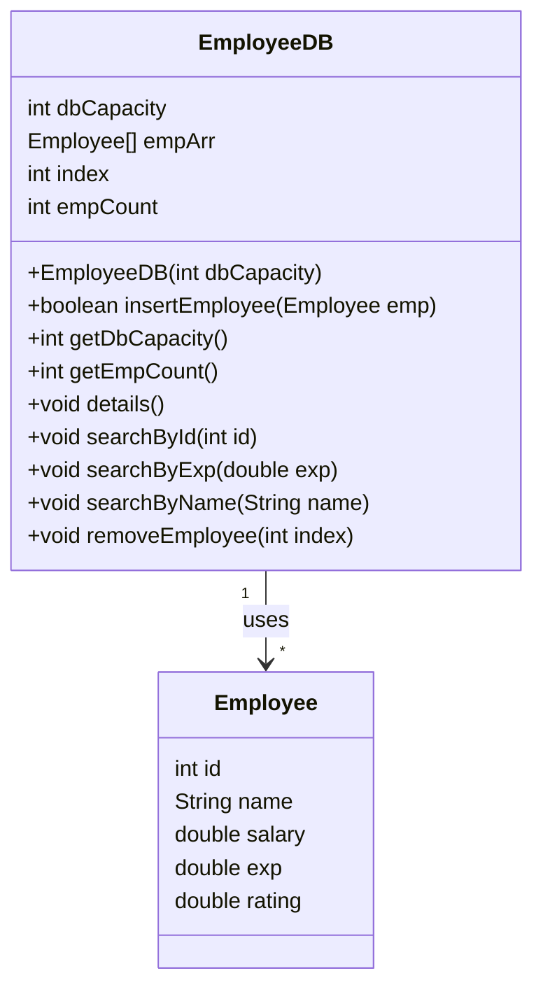

# EmployeeDB.java Documentation

This document provides a detailed overview of the `EmployeeDB` class, which acts as an in-memory database for storing and managing employee records. The class supports basic operations such as insertion, searching, deletion, and display of employee data.

---

## Purpose and Overview

The `EmployeeDB` class is designed to:

- Store employee records up to a fixed capacity.
- Allow insertion of new employees.
- Enable searching employees by ID, experience, or name.
- Remove an employee by index.
- Display all employee records in a tabular format.

This class is useful for educational or small-scale applications where a simple, array-based storage of employees suffices.

---

## Core Fields

The class maintains several important fields:

| Field         | Type          | Description                                            |
|---------------|---------------|--------------------------------------------------------|
| dbCapacity    | `int`         | Maximum number of employees the DB can store           |
| empArr        | `Employee[]`  | Array to hold employee objects                         |
| index         | `int`         | Next insertion position in the array                   |
| empCount      | `int`         | Current count of employees in the database             |

---

## Constructor

The constructor initializes the database with a specified capacity:

```java
public EmployeeDB(int dbCapacity) {
    this.dbCapacity = dbCapacity;
    this.empArr = new Employee[dbCapacity];
}
```
- **dbCapacity**: Defines the maximum number of employees the database can hold.

---

## Main Methods

### Insert Employee

Adds a new employee to the database if there is capacity.

```java
public boolean insertEmployee(Employee emp)
```

- Returns `true` if insertion is successful.
- Returns `false` if the database is full.
- Prints a message on success or failure.

---

### Get Database Capacity

Returns the maximum capacity of the database.

```java
public int getDbCapacity()
```

---

### Get Employee Count

Returns the current number of employees stored.

```java
public int getEmpCount()
```

---

### Display All Employee Details

Prints all employees in a formatted table.

```java
public void details()
```

- Iterates over the `empArr` array and prints details for each employee.

---

### Search Functionality

#### Search by ID

Finds and prints details of the employee with the given ID.

```java
public void searchById(int id)
```
- If found, prints the employee's details.
- If not found, prints "Data Not Found".

#### Search by Experience

Finds and prints details of employees with the specified experience.

```java
public void searchByExp(double exp)
```
- If any employee matches, prints details.
- If none found, prints "Data Not Found".

#### Search by Name

Finds and prints details of employees with the specified name (case-insensitive).

```java
public void searchByName(String name)
```
- If any employee matches, prints details.
- If none found, prints "Data Not Found".

---

### Remove Employee

Removes an employee by shifting left all subsequent employees in the array.

```java
public void removeEmployee(int index)
```
- If index is invalid, prints "Invalid index".
- Otherwise, shifts all employees left, overwriting the removed employee.
- Prints "Employee deleted" on success.

---

## Class Diagram

The following class diagram illustrates the structure and relationships of `EmployeeDB` with the `Employee` class:



---

## Example Usage

Here's a basic example of how to use `EmployeeDB`:

```java
EmployeeDB db = new EmployeeDB(5);
db.insertEmployee(new Employee(1, "Alice", 50000, 5, 4.5));
db.insertEmployee(new Employee(2, "Bob", 45000, 3, 4.0));
db.details();

db.searchById(1);
db.searchByExp(5);
db.searchByName("alice");

db.removeEmployee(0);
db.details();
```

---

## Key Points

- The class does not handle dynamic resizing; once the array is full, no more employees can be added.
- All search operations perform linear searches.
- Deletion shifts array elements manually and does not reduce the array size.
- The implementation assumes the `Employee` class has fields: `id`, `name`, `salary`, `exp`, and `rating`.

---

```card
{
    "title": "Array-based Approach",
    "content": "EmployeeDB uses a fixed-size array for storage. It is simple but not suitable for large datasets."
}
```

---

## Limitations & Best Practices

- **No synchronization**: Not thread-safe for concurrent operations.
- **No null checks in display**: The `details()` method will throw a `NullPointerException` if not all array slots are filled.
- **No update functionality**: Cannot update an employee once inserted.
- **No persistent storage**: Data is in-memory only.

---

## Conclusion

The `EmployeeDB` class is a basic, array-backed employee management component suitable for learning or small projects. For production needs, consider using more robust data structures or databases.
